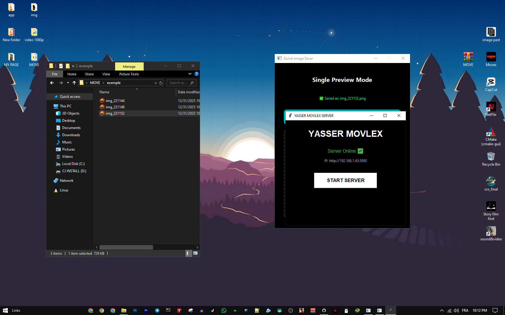
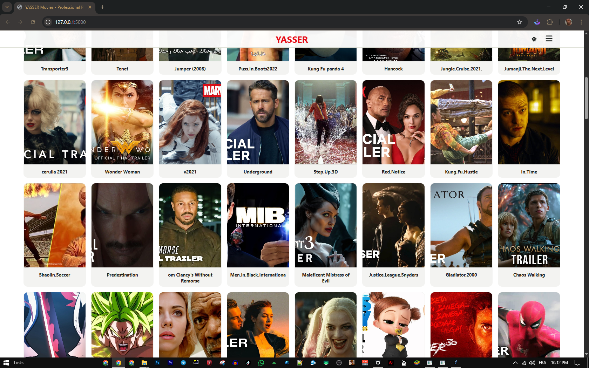
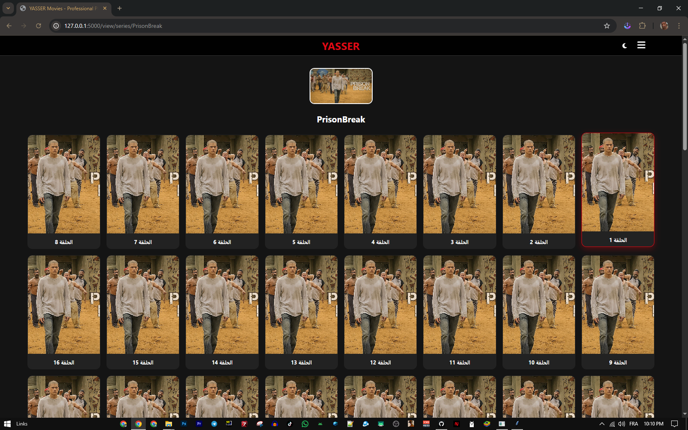

# Home-move-server
##ENJOY
---

---

## 🚀 How to Use
1.  add your film to /media/films/your film.mp4/mkv+your cover.png same name
2.  for series and anime /media/series/your name folder/s1/your episode numer+cover same name
3.  for music video /media/music video/your video music +cover same name
4.  start server download here [MOVE](https://github.com/YASSER-27/Home-move-server/releases/download/v1/Moves.exe)) or download all projet here[all projet](https://github.com/YASSER-27/Home-move-server/releases/download/v1/MOVE.zip)
make sure you run move.exe or move.py in same folder 
