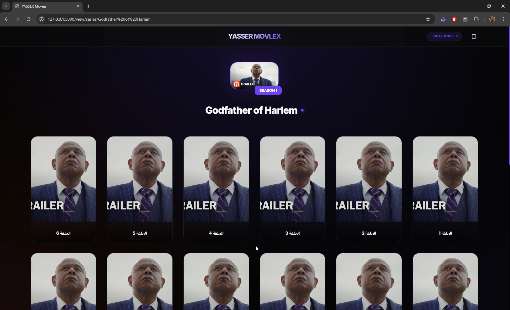
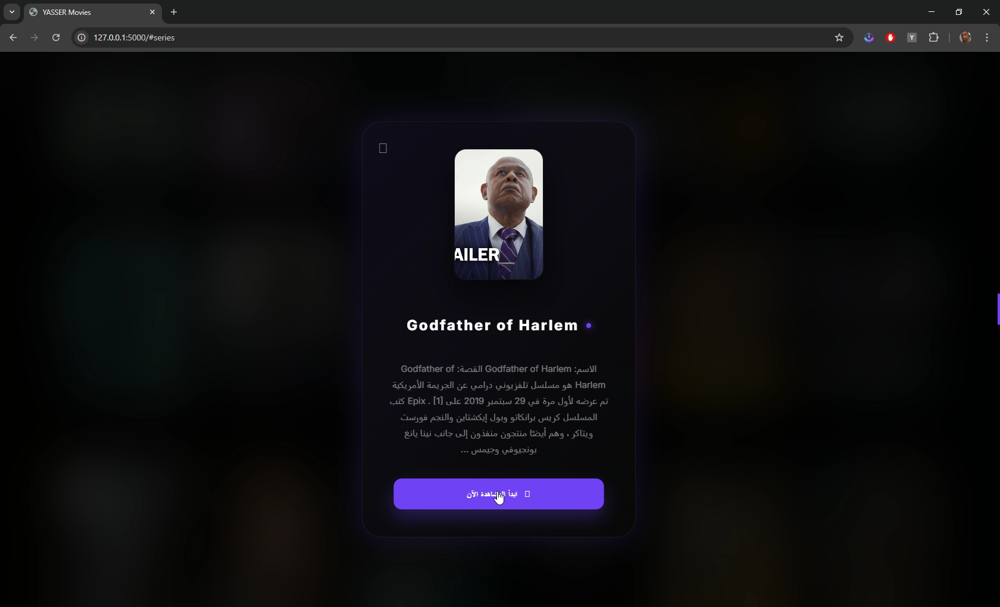
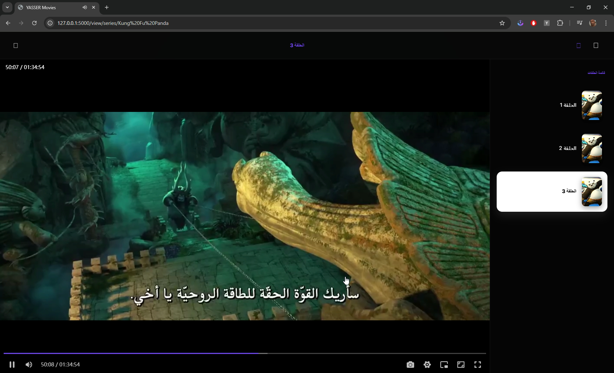
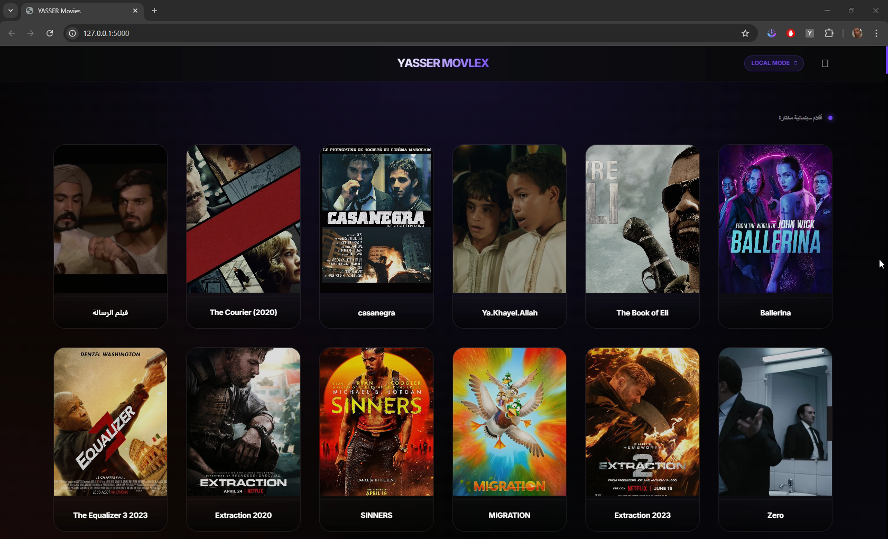
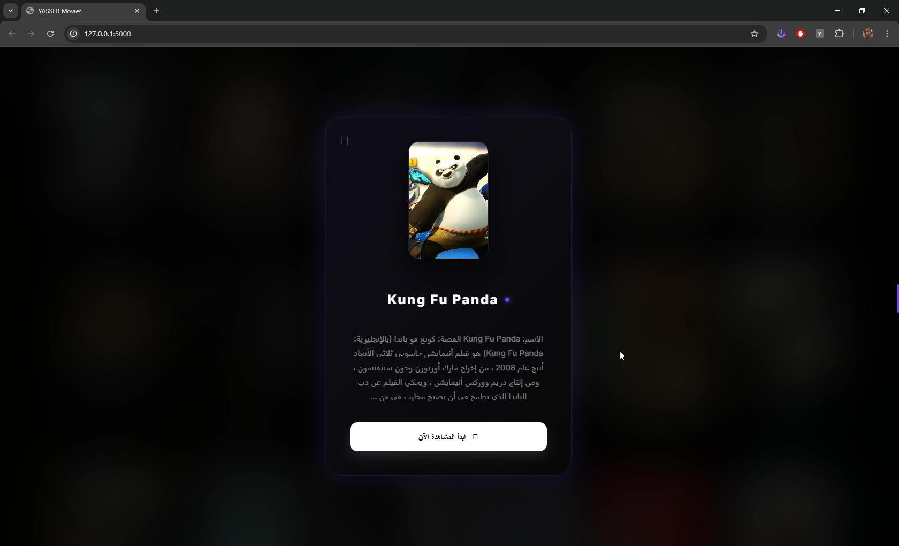
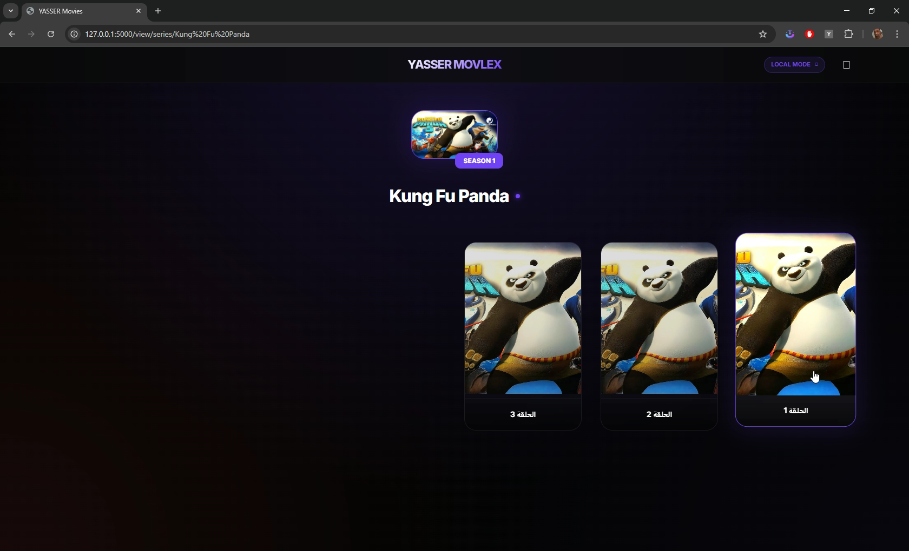

<div align="center">
    
    <h1>FILM</h1>
    <p>HOME CINEMA Offline 2.0.0</p>
</div>

<p align="center">
  
  
</p>

## Description
1.  add your film to /media/films/your film.mp4 +your cover.png same name
2.  for series and anime /media/series/your name folder/s1/your episode numer+cover same name
3.  for music video /media/music video/your video music +cover same name

| Image | Image |
|---|---|
|  |  |
|  |  |





| Image | Image |
|---|---|
|  |  |
|  |  |

---

### Download Now [FILM](https://github.com/YASSER-27/Home-move-server/releases/download/2.0.0/Film.exe)

## ROOT

```bash
Home-move-server-main/
├── MOVE OFFLINE.exe
├── media
│   ├── anime
│   │   ├── MrBeen
│   │   │   └── s1
│   │   │       └── Episode 53.mp4
│   │   ├── MrBeen.jpg
│   │   └── MrBeen.txt
│   ├── films
│   │   ├── jungle.jpg
│   │   ├── jungle.mp4
│   │   └── jungle.txt
│   ├── music
│   │   ├── Billie Eilish.jpg
│   │   └── Billie Eilish.mp4
│   └── series
│       ├── 1899
│       │   ├── about_series.txt
│       │   └── s1
│       │       └── Episode 01.mp4
│       ├── 1899.jpg
│       └── 1899.txt
├── static
│   ├── artplayer.js
│   ├── default.jpg
│   └── fontawesome.css
└── templates
    ├── episodes.html
    └── index.html
```

##  How to Use
>
> 1.  add your film to /media/films/your film.mp4 +your cover.png same name
> 2.  for series /media/series/your name folder/s1/ episode + cover same name
> 3.  for music video /media/music video/your video music +cover same name
> 4.  for watch from phone or pc or tv same network add (Host)

### Author
**YASSER-27** - [GitHub](https://github.com/YASSER-27/) 


